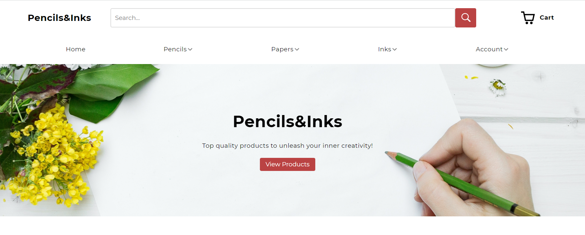

# Pencils and Inks



#### Top Technologies

[](#) 
[](#) 
[](#)
[](#)

Pencils and Inks is an e-commerce website that I developed from scratch using React & Next js for the client side and Ruby on Rails for the server API. The website includes various features such as; products, users, filter settings, a review system with ratings, a shopping cart, and an admin panel for CRUD operations.

The project is currently live on the web at : [https://pencils-and-inks.netlify.app](https://pencils-and-inks.netlify.app/)

## Backend

I built the server API using Ruby with the Ruby on Rails framework.

The backend codebase can be viewed on the github repo below. :arrow_down:

:white_square_button: [Pencils and Inks Backend](https://github.com/ElierHP/pencils-and-inks-server)

## Installation - Frontend

1. Download repository
   ```bash
   git clone https://github.com/ElierHP/pencils-and-inks.git
   ```
2. Install packages
   ```bash
   npm install
   ```
3. Run development server
    ```bash
    npm run dev
    ```
## Installation - Backend

1. Download repository

   ```bash
   git clone https://github.com/ElierHP/pencils-and-inks-server
   ```

2. Install packages

   ```bash
   bundle install
   ```

3. Run development server
   ```bash
   rails s
   ```

#### :mailbox: Reach out to me!

- :email: elierporto@gmail.com
